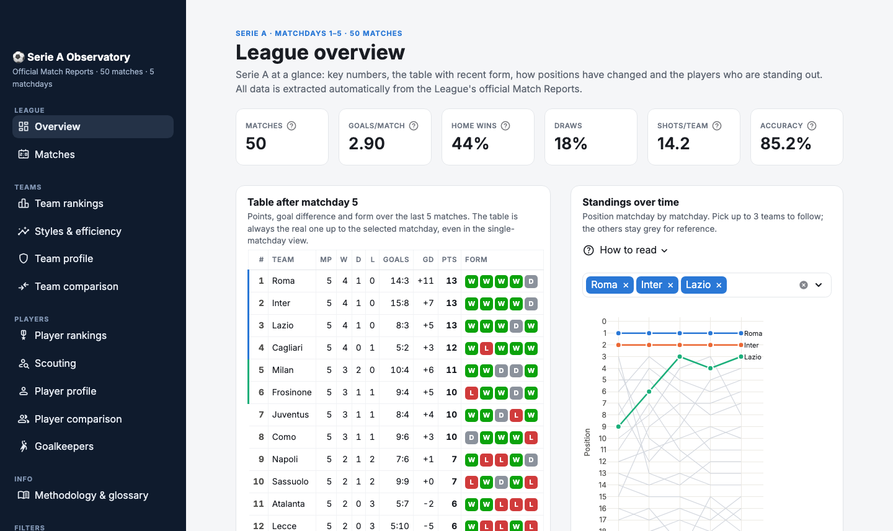
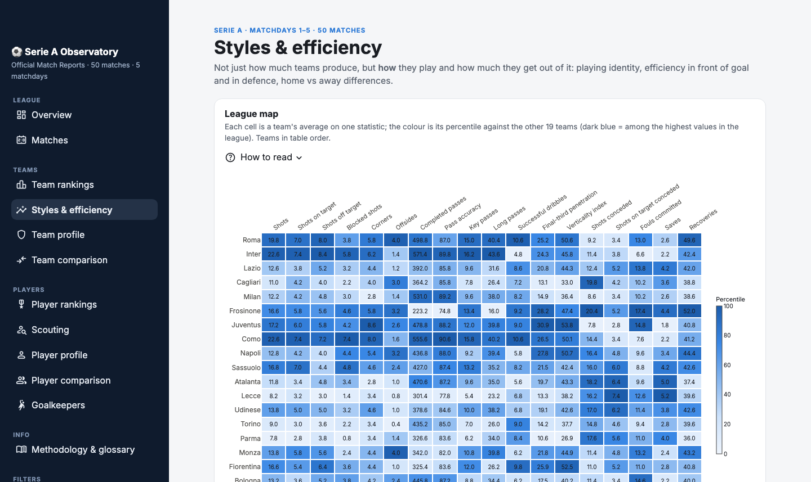
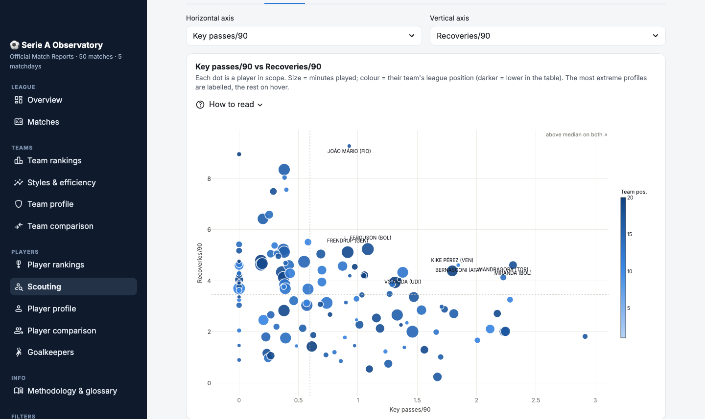
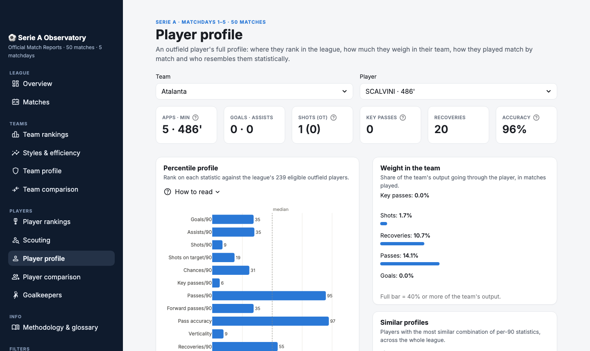

# Serie A Observatory

[](https://serie-a-observatory.streamlit.app)

An interactive Serie A analytics dashboard built **from the official Lega Serie A Match Report PDFs**: automatic data extraction from the PDFs, team and player statistics, rankings, comparisons and scouting tools.

The analytical goal is to **separate an individual player's value from the context of their team**, to find players who perform better than their team's numbers suggest. In a team near the bottom of the table absolute volumes are low for everyone, so the dashboard relies on normalised measures: per-90 rates, share of team output and percentiles.



---

## What's in the dashboard

12 pages in 4 sections, with global filters (matchday, full season or single matchday, highlighted team) and an explanation for every chart.

| Section | Pages |
|---|---|
| **League** | **Overview**: key numbers, table with qualification zones and recent form, standings over time, leaders, data-generated insights · **Matches**: home vs away comparison and individual match sheets |
| **Teams** | **Team rankings** · **Styles & efficiency**: league percentile map, playing-style map, attacking and defensive efficiency, home vs away · **Team profile** · **Team comparison** |
| **Players** | **Player rankings** (per 90, totals, efficiency, discipline, custom ranking) · **Scouting** · **Player profile** with percentile profile and similar players · **Player comparison** · **Goalkeepers** |
| **Info** | **Methodology & glossary**: source, method, definition of every metric, known limitations, quality checks |

| Styles & efficiency | Scouting |
|---|---|
|  |  |



### Main analyses

- **Per-90 rates** with an adjustable minimum-minutes threshold, excluding matches whose minutes are missing from the PDF.
- **Share of team output**: how much of the team's shots, key passes, recoveries and passes go through a player, counting only the matches they played. It is the most direct measure of "the player carrying the team" and is already comparable across teams.
- **Percentiles** against the league's eligible players, to compare very different metrics on a single scale.
- **Similar players**: cosine similarity on standardised per-90 values, to find statistical alternatives in other teams.
- **Profile search**: minimum percentiles on several metrics combined, scoped by league position, with CSV export.
- **Team maps**: playing identity (verticality vs accuracy), efficiency (shots vs goals scored/conceded), home/away performance, a summary style index.

---

## The data

**Source:** the Match Report PDFs published by Lega Serie A, one per match. Each report yields:

- **team statistics** (16 metrics: shots, passes, recoveries, saves…);
- **individual statistics** for every player who took the field (minutes, goals, assists, shots, key passes, passes, recoveries, cards; for goalkeepers goals conceded, saves, parries).

The PDFs are **not included** in the repository (size and rights). The extracted dataset is, in `data/processed/`:

| File | Content |
|---|---|
| `matches.csv` | one row per match: result and home/away team statistics |
| `players.csv` | one row per player per match: individual match sheet |

Current coverage: **matchdays 1–5 of the 2026/27 season, 50 matches, 1,590 player rows**.

---

## How the PDFs are parsed

The most technically demanding part of the project is reading tables from PDFs that are not really tables.

- **Player statistics.** In the PDF a zero statistic is **not printed at all**: a row may contain 7 values for 15 columns, and a number's position in the row does not tell which column it belongs to. The parser reads the **coordinates** of every word (`pdfplumber`), calibrates the centre of each column from the header *of that very page* and assigns each value to the nearest column within a tolerance. Values outside the tolerance are never forced into a column but tracked for review.
- **Cards.** The yellow / second yellow / red columns are merged into a single header token: each card is classified by splitting that space into three zones.
- **Team statistics.** When a row shows a single value (the other team has zero), the team it belongs to is rebuilt from its horizontal position relative to the home/away columns.
- **One code, two meanings.** `PA` means "saves" for goalkeepers and "forward passes" for everyone else: goalkeepers and outfield players are aggregated separately.

**Validation:** across all 50 matches no value is left unassigned to a column. The development notebook also reconciles the sum of individual statistics with the team statistics of the same report (`src/data_quality.py`), to tell parser errors apart from inconsistencies already present in the source PDF.

---

## Getting started

Requirements: Python 3.11.

```bash
git clone https://github.com/matteovezzoli/serie-a-observatory.git
cd serie-a-observatory
pip install -r requirements.txt
streamlit run app.py
```

The dashboard starts from the dataset in `data/processed/`, no PDFs needed.

### Adding a matchday

1. Download the Match Reports and put them in a new folder: `data/<matchday>/*.pdf`.
2. Start the dashboard: the PDFs are read, the CSVs in `data/processed/` are regenerated and the new data shows up immediately. The first read takes a few minutes; the result is then cached until the PDFs change.

---

## Project structure

```
├── app.py                    # entry point: data loading, filters, navigation
├── views/                    # one dashboard page per module
├── src/
│   ├── parsing.py            # team statistics extraction from the PDFs
│   ├── player_parsing.py     # player statistics extraction (coordinates, cards)
│   ├── aggregation.py        # team tables, standings, averages
│   ├── player_aggregation.py # player tables: totals, per 90, shares, goalkeepers
│   ├── analysis.py           # standings over time, form, percentiles, similar players
│   ├── metrics.py            # registry of team metrics
│   ├── glossary.py           # labels and definitions of every metric
│   ├── plotting.py           # Plotly charts and chart theme
│   ├── ui.py                 # interface components and styling
│   ├── context.py            # data of the current view, shared by all pages
│   ├── dataset.py            # CSV dataset export/loading
│   └── data_quality.py       # player vs team reconciliation (notebook only)
├── exploration.ipynb         # development notebook and parser validation (in Italian)
├── data/processed/           # extracted dataset (CSV)
└── docs/screenshots/
```

Code comments and the development notebook are in Italian; the dashboard and this README are in English.

---

## Known limitations

- **No positions in the match sheet**: the PDF does not say where a player plays, so rankings mix roles. That is why the dashboard avoids a single overall score and favours multi-dimensional comparisons, shares of team output and similar players.
- **No event data**: no expected goals or shot locations; efficiency (goals/shots) cannot tell easy chances from hard ones.
- **Small samples**: early in the season percentages and shares can change a lot from one matchday to the next.
- **Estimated attempted passes**: rebuilt from completed passes and percentage, which the PDF rounds.

Full details on the dashboard's *Methodology & glossary* page.

---

## Tech stack

Python · pdfplumber · pandas · NumPy · Plotly · Streamlit

---

## License

Code released under the [MIT License](LICENSE). The match data belongs to Lega Serie A and is not covered by this license.

---

*Personal study project, not affiliated with Lega Serie A. The data is extracted from documents published by the League.*
